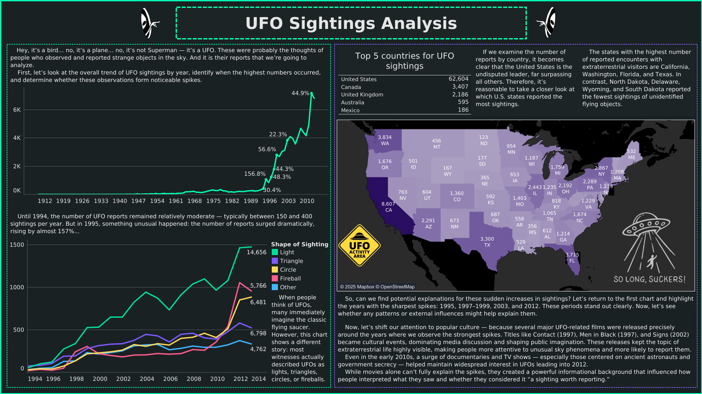

# UFO Sightings Analysis

An exploratory data analysis project on UFO sightings. The goal is to practice Python data cleaning and build an interactive Tableau dashboard that highlights trends, geography, and notable patterns.

## Dataset
Source: [UFO Sightings Dataset (Kaggle)](https://www.kaggle.com/datasets/NUFORC/ufo-sightings/data)

The dataset contains reported UFO sighting records with fields such as:
- **Datetime** of the sighting
- **City, state, country** location fields
- **Shape** description
- **Duration (seconds)**
- **Comments** (free‑text witness notes)
- **Date posted** (report submission date)
- **Latitude/longitude**

## What’s inside
- **Python cleaning notebook:** [py_data_cleaning.ipynb](py_data_cleaning.ipynb)
- **Tableau workbook:** [UFO_Sightings_tableau_file.twbx](UFO_Sightings_tableau_file.twbx)
- **Interactive dashboard:** [UFO Sightings Dashboard](https://public.tableau.com/app/profile/pavlo.nadvoretskyi/viz/UFOSightings_17638390135390/Dashboard1?publish=yes)

## Process (Python → Tableau)
The full workflow is documented in [py_data_cleaning.ipynb](py_data_cleaning.ipynb). Key steps include:

### 1) Load and inspect
- Load the raw CSV with robust parsing to handle malformed lines.
- Inspect column types and identify invalid values.

### 2) Datetime cleanup
- Fix the non‑standard `24:00` time format by converting to `00:00` and adding one day.
- Parse the cleaned values into a proper datetime column.

### 3) Type normalization
- Convert `duration (seconds)`, `latitude`, and `longitude` to numeric.
- Parse `date posted` as a datetime.

### 4) Missing values and outliers
- Drop rows without latitude (required for mapping).
- Remove non‑positive durations.
- Cap extreme duration outliers by keeping values up to the 96th percentile.

### 5) Country extraction from city
- Some records embed country hints in the `city` field (in parentheses).
- Extract, normalize, and map these values to a standard country name.
- Use the extracted value to fill missing `country` entries.

### 6) Export for Tableau
- Select curated columns and standardize text casing.
- Export a clean CSV for visualization.

## Preview

## Notes
- The notebook focuses on cleaning, standardizing dates/locations, and preparing the dataset for Tableau.
- The dashboard explores temporal trends, geographic hotspots, and country‑level summaries.
# UFO_Sightings
